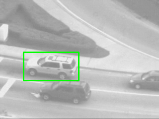
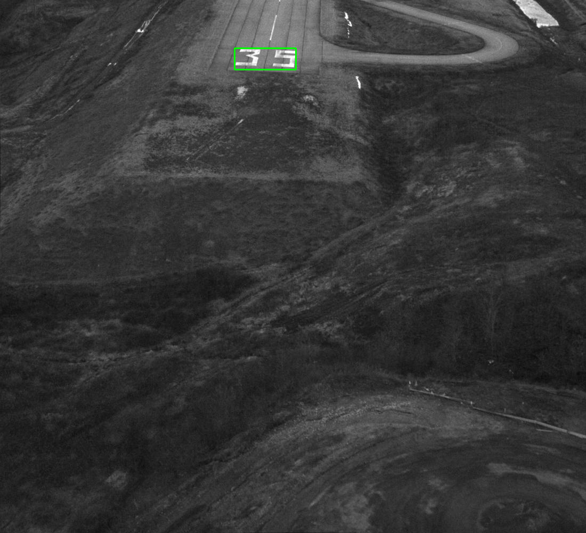

# Tracking Objects in Videos
**Objective:** Implement the Lucas-Kanade algorithm to track an object in a video sequence.

## Key Steps:

  1. **Initialization:**

  * Draw a bounding box around the target object in the first frame (template).
    
  2. **Iterative Tracking:**

  * For each subsequent frame:
      * Compute the updated warping parameters between the current frame and the initial frame using lucas kanade.
      * Warp the initial bounding box using the updated parameters.
      * Draw the bounding box on the current frame and append it to the new video sequence.
   
  3. **Lucas Kanade Algorithm**
  
  * Compute the image gradients (Ix and Iy) using Sobel operators.

  * Perform iterative optimization to estimate the warping parameters:
    
     * Update the warp matrix (W) based on the current parameters (p).
        
     * Warp the coordinates using the warp matrix.
        
     * Extract pixel intensities (T) from the template.
        
     * Extract pixel intensities (I) from the next frame at the warped coordinates.
        
     * Compute the error (E) between the intensities of the template and the frame.
        
     * Compute steepest descent matrix (SD) based on image gradients and coordinates of ROI.
        
     * Compute the Hessian matrix (H) using the steepest descent matrix.
        
     * Update the warping parameters (p).
        
     * Check convergence by evaluating the norm of the parameter update.
        
     * Repeat until convergence or maximum iterations are reached.
        
  * Return the warped matrix (W) and refined warping parameters (p).

## Region of Interest:

  * **Car**
  
  
  
  * **Landing Helicopter**
  
  
